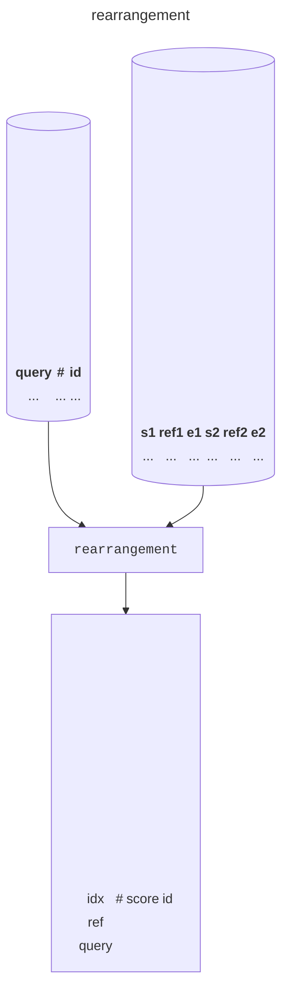
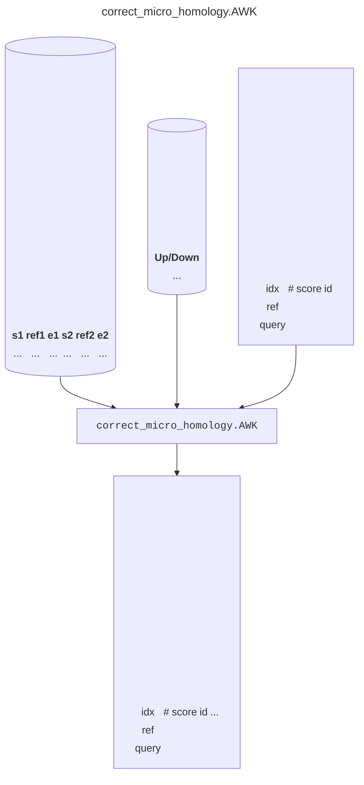

# Introduction

TODO
- animation of stagger, large resection, mmej
- example of alignment
- compare with CRISPResso
- animation of algorithm

# Installation

```console
$ conda install bioconda::rearr
```

# Chimeric alignment



TODO
- Example support specify the start and end of reference.
- Example folder for rearrangement.
- Output example in markdown.

```
$ rearrangement -h
###Basic Usage
rearrangement <input_file 3<reference_file

### Parameters
-h, -help, --help: Display help.
# Aligning Parameters
-s0: Mismatching score. (default: -3)
-s1: Matching score for non-extension reference part. (default: +1)
-s2: Matching score for extension reference part. (default: +1)
-u: Gap-extending penalty. (default: -2)
-v: Gap-opening penalty. (default: -5)
-ru: Gap-extending penalty for unaligned reference ends. (default: 0)
-rv: Gap-opening penalty for unaligned reference ends. (default: 0)
-qu: Gap-extending penalty for unaligned query parts. (default: 0)
-qv: Gap-opening penalty for unaligned query parts. (default: 0)
```

# Correct microhomology



TODO
- Animation support the necessity of MH correction.
- Example folder for MH correction.
- Example output in markdown.

# Workflow

```mermaid
---
title: Workflow
---
flowchart TD
    R1[(fqR1)] --> RD[<code>removeDuplicates.md</code>]
    R2[(fqR2)] --> RD
    RD --> RDF[(
        <table>
            <tr>
                <th>R1</th>
                <th>R2</th>
                <th>#</th>
            </tr>
            <tr>
                <td>...</td>
                <td>...</td>
                <td>...</td>
            </tr>
        </table>
    )]
    RDF --> DM[<code>demultiplex.md</code>]
    REFSET[(
        <table>
            <tr>
                <th>R1 ref</th>
                <th>R2 ref</th>
            </tr>
            <tr>
                <td>...</td>
                <td>...</td>
            </tr>
        </table>
    )]
    REFSET --> DM
    DM --> DMF[(
        <table>
            <tr>
                <th>R1</th>
                <th>R2</th>
                <th>#</th>
                <th>id</th>
                <th>...</th>
            </tr>
            <tr>
                <td>...</td>
                <td>...</td>
                <td>...</td>
                <td>...</td>
                <td>...</td>
            </tr>
        </table>
    )]
    DMF --> INPUT[(
        <table>
            <tr>
                <th>query</th>
                <th>#</th>
                <th>id</th>
            </tr>
            <tr>
                <td>...</td>
                <td>...</td>
                <td>...</td>
            </tr>
        </table>
    )]
    INPUT --> REARR[<code>rearrangement</code>]
    REF[(
        <table>
            <tr>
                <th>s1</th>
                <th>ref1</th>
                <th>e1</th>
                <th>s2</th>
                <th>ref2</th>
                <th>e2</th>
            </tr>
            <tr>
                <td>...</td>
                <td>...</td>
                <td>...</td>
                <td>...</td>
                <td>...</td>
                <td>...</td>
            </tr>
        </table>
    )] --> REARR
    REARR --> OUTPUT[
        <table>
            <tr>
                <td>idx</td>
                <td>#</td>
                <td>score</td>
                <td>id</td>
            </tr>
            <tr>
                <td>ref</td>
            </tr>
            <tr>
                <td>query</td>
            </tr>
        </table>
    ]
    REF --> CORRECT
    CF[(
        <table>
            <tr>
                <th>Up/Down</th>
            </tr>
            <tr>
                <td>...</td>
            </tr>
        </table>
    )] --> CORRECT
    OUTPUT --> CORRECT[<code>correct_micro_homology.AWK</code>]
    CORRECT --> COROUTPUT[
        <table>
            <tr>
                <td>idx</td>
                <td>#</td>
                <td>score</td>
                <td>id</td>
                <td>...</td>
            </tr>
            <tr>
                <td>ref</td>
            </tr>
            <tr>
                <td>query</td>
            </tr>
        </table>
    ]
```



TODO
- Example folder for workflow
- Example intermediate outputs in markdown.

# Container

Docker is built automatically by the github workflow of bioconda at https://quay.io/repository/biocontainers/rearr. Singularity is built by galaxy project at https://depot.galaxyproject.org/singularity. These images contain only necessary tools for analyes. A docker image containing webUI is at ghcr.io/ljw20180420/rearr.

TODO
- example folder for docker
- example folder for singularity

# Downstream analysis

TODO
- example folder for UI image
- show alignment browser
- compare with CRISPResso output result
- show workflow UI

https://qiangwulab.sjtu.edu.cn
